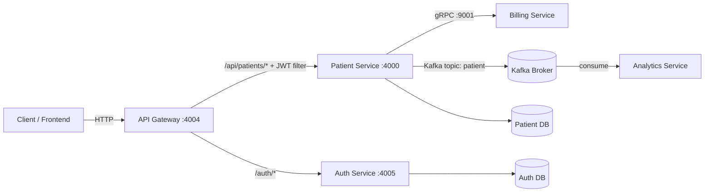
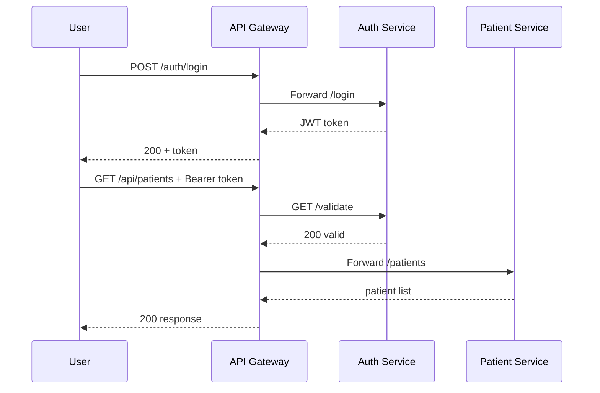

# Patient Management System (Backend)

A microservices backend for patient lifecycle management with secure API access, synchronous service-to-service communication, and asynchronous event processing.

## Table of Contents

- [Overview](#overview)
- [System Architecture](#system-architecture)
- [Service Map](#service-map)
- [Data and Communication Flow](#data-and-communication-flow)
- [Tech Stack](#tech-stack)
- [Repository Layout](#repository-layout)
- [Prerequisites](#prerequisites)
- [Configuration](#configuration)
- [Run the System](#run-the-system)
- [API Guide](#api-guide)
- [Testing](#testing)
- [Biome](#biome)
- [Troubleshooting](#troubleshooting)
- [Roadmap Ideas](#roadmap-ideas)
- [License](#license)

## Overview

This system is composed of Spring Boot services behind an API Gateway:

- `auth-service` issues and validates JWT tokens.
- `api-gateway` handles external routing and protects patient endpoints.
- `patient-service` owns patient CRUD.
- `billing-service` creates billing accounts via gRPC.
- `analytics-service` consumes patient events from Kafka.

## System Architecture

### Graphical (Mermaid)



### Graphical (ASCII)

```text
Client
  |
  | HTTP
  v
API Gateway (4004)
  |---- /auth/* ----------------------------> Auth Service (4005) ----> Auth DB
  |
  |---- /api/patients/* + JWT Validation ---> Patient Service (4000) --> Patient DB
                                                |\
                                                | \-- gRPC (9001) ---> Billing Service
                                                |
                                                \---- Kafka topic "patient" ---> Analytics Service
```

## Service Map

| Service | Purpose | Default Port(s) | Key Dependency |
|---|---|---|---|
| `api-gateway` | External entry point and route protection | `4004` | `auth-service` |
| `auth-service` | Login + JWT validation | `4005` | `JWT_SECRET`, DB |
| `patient-service` | Patient CRUD and domain orchestration | `4000` | `billing-service`, Kafka, DB |
| `billing-service` | Billing account creation over gRPC | HTTP `4001`, gRPC `9001` | gRPC consumers |
| `analytics-service` | Kafka event consumer | Spring Boot default unless set (`4002` in Dockerfile) | Kafka |
| `integration-tests` | End-to-end API tests | N/A | Running services |

## Data and Communication Flow

### Login + Protected Request (Sequence)



### Create Patient Domain Side Effects

1. `patient-service` validates and persists patient.
2. Calls `billing-service` via gRPC to create billing account.
3. Publishes `PATIENT_CREATED` protobuf event to Kafka topic `patient`.
4. `analytics-service` consumes and logs/processes the event.

## Tech Stack

- Java `17`
- Spring Boot `3.5.7`
- Spring Cloud Gateway `2025.0.0`
- Spring Security + JWT (`jjwt`)
- Spring Data JPA
- gRPC + Protocol Buffers
- Kafka
- H2 and PostgreSQL drivers
- Maven

## Repository Layout

```text
.
|-- api-gateway/
|   `-- src/main/resources/application.yml
|-- auth-service/
|-- patient-service/
|-- billing-service/
|-- analytics-service/
|-- integration-tests/
|-- api-requests/       # REST client samples
|-- grpc-requests/      # gRPC request samples
|-- README.md
`-- biome.json
```

## Prerequisites

- Java `17+`
- Maven `3.9+` (or `mvnw`/`mvnw.cmd` per service)
- Kafka broker reachable from services

Optional:
- PostgreSQL (if you choose external DB config)

## Configuration

### Required environment variables

```powershell
$env:AUTH_SERVICE_URL="http://localhost:4005"
$env:JWT_SECRET="REPLACE_WITH_BASE64_ENCODED_SECRET"
$env:SPRING_KAFKA_BOOTSTRAP_SERVERS="localhost:9092"
```

### Property mapping reference

| Env var | Used by | Property key |
|---|---|---|
| `AUTH_SERVICE_URL` | `api-gateway` | `auth.service.url` |
| `JWT_SECRET` | `auth-service` | `jwt.secret` |
| `SPRING_KAFKA_BOOTSTRAP_SERVERS` | `patient-service`, `analytics-service` | `spring.kafka.bootstrap-servers` |
| `BILLING_SERVICE_ADDRESS` (optional) | `patient-service` | `billing.service.address` |
| `BILLING_SERVICE_GRPC_PORT` (optional) | `patient-service` | `billing.service.grpc.port` |
| `SERVER_PORT` (optional) | any service | `server.port` |

Notes:
- `JWT_SECRET` must be Base64 and strong enough for HMAC signing.
- gRPC defaults are `localhost:9001` when billing overrides are not set.

## Run the System

### Recommended startup order

1. `auth-service`
2. `billing-service`
3. `patient-service`
4. `analytics-service`
5. `api-gateway`

### PowerShell commands (from repo root)

```powershell
cd .\auth-service; .\mvnw.cmd spring-boot:run
cd ..\billing-service; .\mvnw.cmd spring-boot:run
cd ..\patient-service; .\mvnw.cmd spring-boot:run
cd ..\analytics-service; .\mvnw.cmd spring-boot:run
cd ..\api-gateway; .\mvnw.cmd spring-boot:run
```

### Dockerfiles

Each service has a Dockerfile, but there is currently no root `docker-compose.yml` in this repository.

## API Guide

Base URL (gateway): `http://localhost:4004`

### 1) Login

`POST /auth/login`

```json
{
  "email": "testuser@test.com",
  "password": "password123"
}
```

### 2) Validate token

`GET /auth/validate`

Header:

```http
Authorization: Bearer <token>
```

### 3) Get patients

`GET /api/patients`

### 4) Create patient

`POST /api/patients`

```json
{
  "name": "John Doe",
  "email": "john.doe@demo.com",
  "address": "123 Main St",
  "dateOfBirth": "1995-09-09",
  "registeredDate": "2026-02-15"
}
```

### 5) Update patient

`PUT /api/patients/{id}`

```json
{
  "name": "John Doe",
  "email": "john.updated@demo.com",
  "address": "123 Main St",
  "dateOfBirth": "1995-09-09"
}
```

### 6) Delete patient

`DELETE /api/patients/{id}`

### API docs

- Patient docs through gateway: `http://localhost:4004/api-docs/patients`
- Auth docs through gateway: `http://localhost:4004/api-docs/auth`

### Seeded credentials

Default seeded login user exists in `auth-service/src/main/resources/data.sql`:

- Email: `testuser@test.com`
- Password: `password123`

## Testing

### Unit tests (per module)

```powershell
cd .\patient-service; .\mvnw.cmd test
```

Repeat for `auth-service`, `billing-service`, `analytics-service`, `api-gateway`.

### Integration tests

`integration-tests` expects all required services already running.

```powershell
cd .\integration-tests
mvn test
```

## Biome

Biome configuration exists at `biome.json` and is intended for non-Java files (JSON, JSONC, JS/TS if added later).

```powershell
npx @biomejs/biome check .
npx @biomejs/biome format --write .
```

## Troubleshooting

- `401 Unauthorized` on `/api/patients`:
  - Verify `Authorization: Bearer <token>` header.
  - Verify `AUTH_SERVICE_URL` points to active `auth-service`.
- Gateway fails with missing `auth.service.url`:
  - Set `AUTH_SERVICE_URL`.
- Auth fails to start or token ops fail:
  - Set a valid Base64 `JWT_SECRET`.
- Kafka publish/consume issues:
  - Check `SPRING_KAFKA_BOOTSTRAP_SERVERS` and broker health.
- gRPC errors from `patient-service` to billing:
  - Confirm billing gRPC server available at `localhost:9001` or your override.

## Roadmap Ideas

- Add root `docker-compose.yml` for one-command local environment.
- Add centralized config and service discovery.
- Add distributed tracing (OpenTelemetry) and metrics dashboards.
- Add CI pipeline for build + tests + lint checks.

## License

Add your license text or SPDX identifier (for example `MIT` or `Apache-2.0`).
